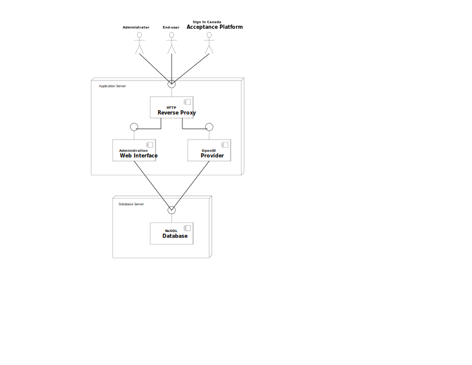

# MFA4ATIP Architecture Overview

## Architecture Details

* [Software and Components](components.md)
* [Communication and Connections](connections.md)
* [Data Elements](data_elements.md)
* [Integration](integration.md)
* [User Flow](ui_flows.md)
